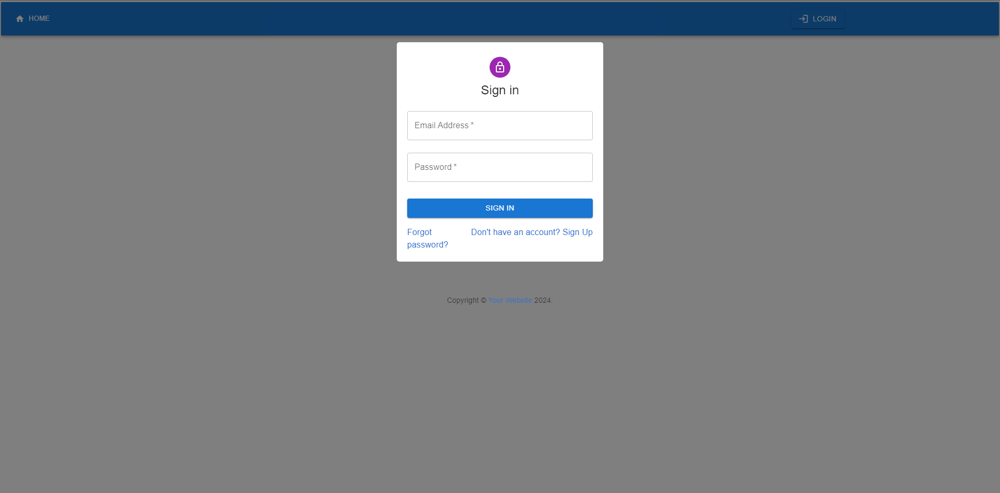
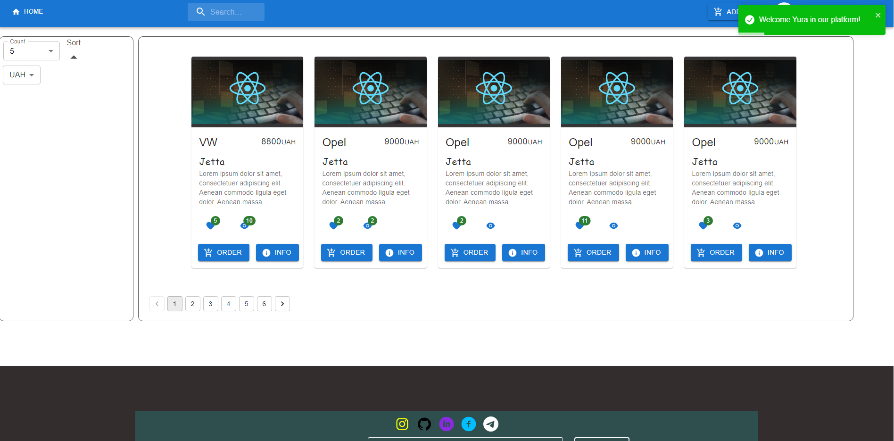
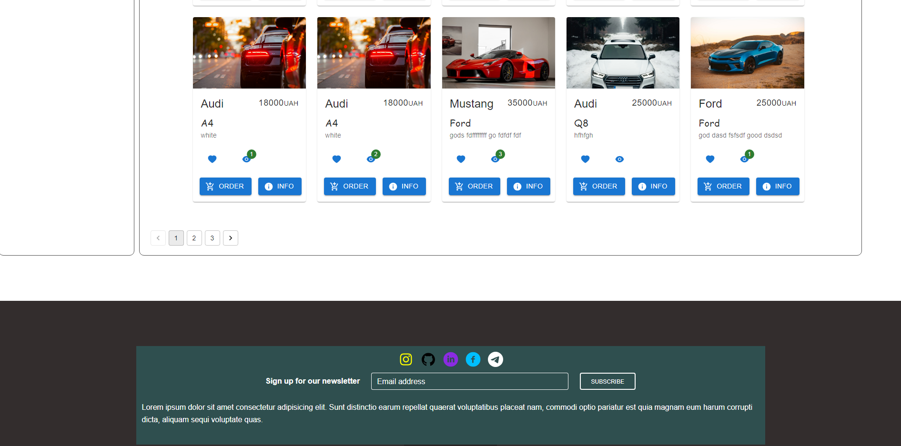
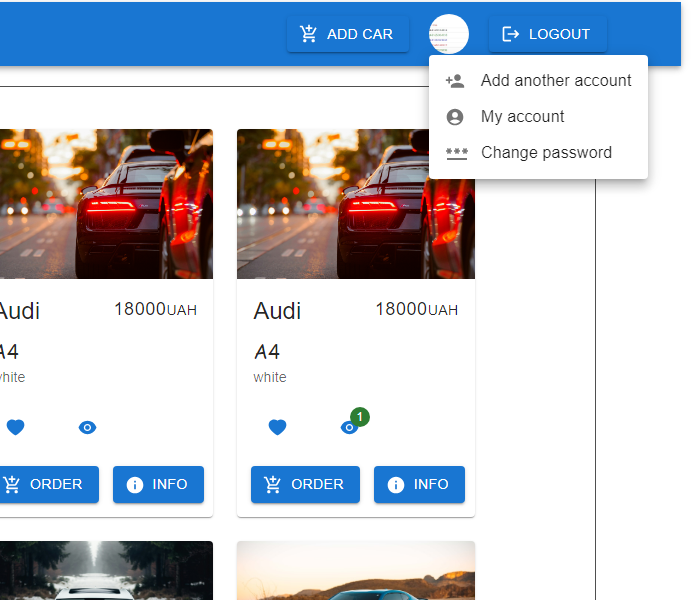
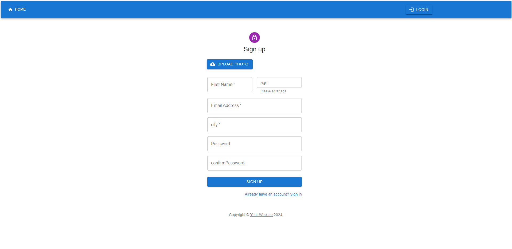
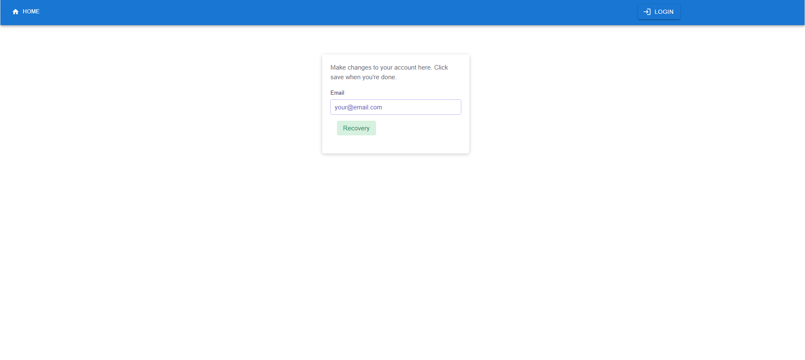
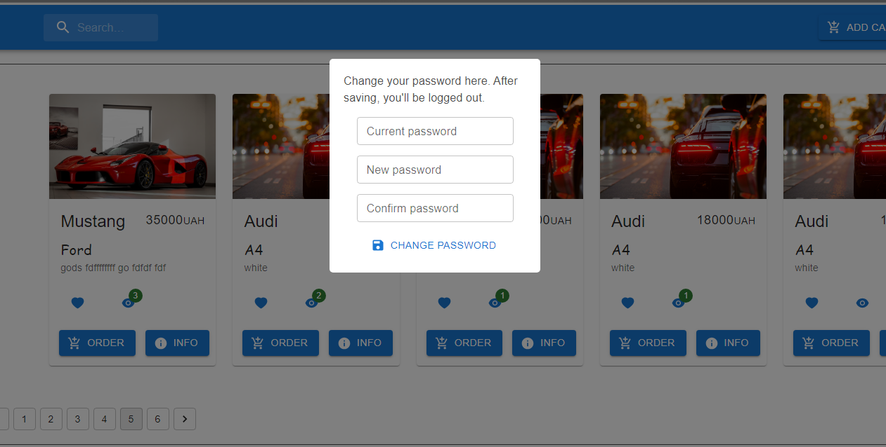
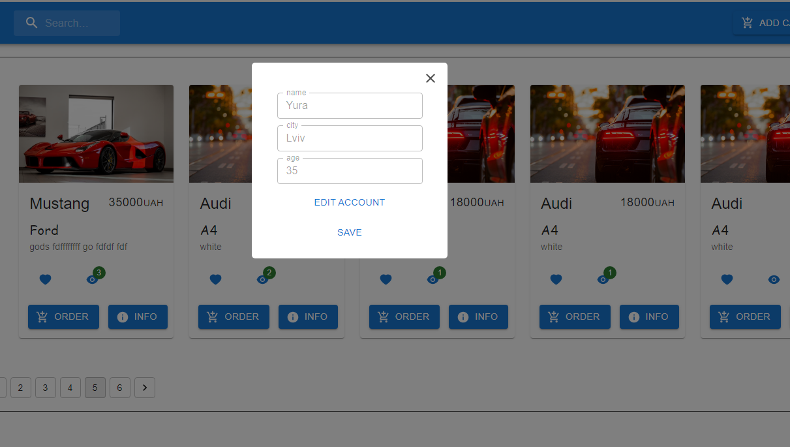
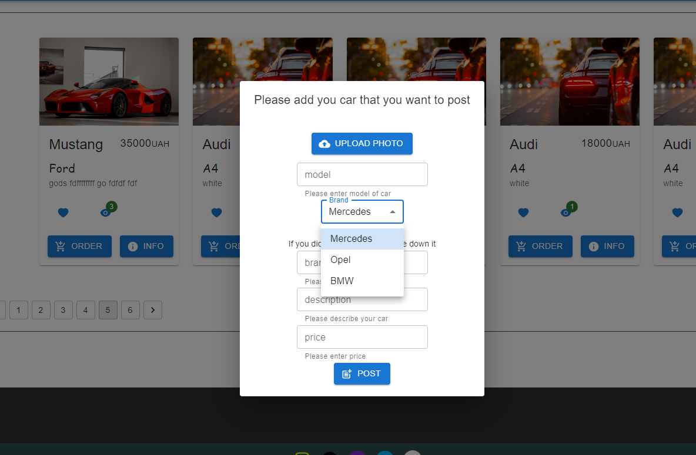

## Usage

To run this project locally, follow these steps:

1. **Clone the repository:**

2. **Install dependencies:**
3. **Start the development server:**

The application includes the following private routes:

- `/`: Landing page displaying a list of cars. Accessed by default.
- `/create`: Page for signing up.
- `/forgot_password`: Page for recovering password.
- `/forgotWithToken/:token`: Page for password recovery after email with token.
- `/carInfo`: Page displaying detailed information about a car.

## Components

### `CarList`

Component displaying a list of cars.

### `SignUp`

Component for signing up.

### `RecoveryPassword`

Component for recovering password.

### `RecoveryPasswordAfterEmail`

Component for password recovery after email with token.

### `CarViews`

Component displaying detailed information about a car.

## Layouts

### `MainLayout`

Main layout component wrapping the entire application.
## Router

The application uses React Router for navigation. The routes are defined in `routes.ts` file.

## Axios Configuration

This project uses Axios for making HTTP requests to the backend server. Axios is configured with interceptors to handle authentication tokens and token refreshing.

### Base URL

The base URL for the backend server is set to `http://localhost:3005`.

### Mutex

A mutex is created to ensure that only one request is sent to the token refresh endpoint at a time.

### Instance Creation

An Axios instance is created with the base URL.

### Request Interceptor

A request interceptor is added to the Axios instance to attach the JWT access token to each request's headers if available.

### Response Interceptor

A response interceptor is added to the Axios instance to handle unauthorized (401) responses. If the response status is 401 and a refresh token is available, it attempts to refresh the access token using the refresh token. If the token refresh is successful, it updates the access token in the local storage and retries the failed request with the new access token. If the refresh token is expired or the refresh fails for any reason, the user is logged out and redirected to the login page.

### History

The project uses the `createBrowserHistory` function from the `history` package to manage navigation history.

## Authentication and User Services

The project includes services for handling authentication and user-related operations. These services encapsulate API calls using Axios to interact with the backend server.

### AuthenticationService

The `authService` provides methods for user authentication, password management, and user registration.

- **`login(user: FormType): Promise<ITokensPair>`**: Logs in a user with the provided credentials. Returns a promise that resolves with an object containing access and refresh tokens upon successful authentication.
- **`refresh(refreshToken: string): Promise<ITokensForRefresh>`**: Refreshes the access token using a refresh token. Returns a promise that resolves with a new access token upon successful token refresh.
- **`logOut(): Promise<void>`**: Logs out the current user by invalidating their session on the server.
- **`forgotPassword(email: string): Promise<void>`**: Initiates the password recovery process for the specified email address.
- **`changePassword(data: FormTypeForChangePassword): Promise<void>`**: Changes the user's password using the provided old and new passwords.
- **`recoveryPassword(password: string, token: string): Promise<void>`**: Completes the password recovery process using the provided password and recovery token.
- **`createUser(user: FormTypeCreateUserNew): Promise<void>`**: Creates a new user account with the provided user data.

### UserService

The `userService` provides methods for updating user data.

- **`updateUserData(user: FormTypeForUpdate): Promise<void>`**: Updates the user's data with the provided information.

These services abstract the underlying HTTP requests and provide a convenient interface for interacting with the backend server.

## Usage
## Cars API Service

The project includes a service for handling car-related operations with the backend server.

### CarsApiService

The `carsApiService` provides methods for interacting with the car-related endpoints of the backend server.

- **`getAll(params?: ParamsType | void): Promise<GoodsType>`**: Retrieves a list of cars from the server. Optionally accepts parameters such as page, limit, search keyword, and sorting criteria.
- **`getById(id: string): Promise<DataCars>`**: Retrieves details of a specific car by its ID from the server.
- **`likeCar(id: string): Promise<void>`**: Likes a car with the specified ID.
- **`postCar(data: FormType): Promise<GoodsType>`**: Creates a new car listing with the provided car data, including brand, description, model, price, and image.
- **`orderCar(id: string): Promise<void>`**: Places an order for the car with the specified ID.

These methods encapsulate API calls using Axios to interact with the car-related endpoints of the backend server.

## Usage

Ensure that the backend server is running and accessible at the specified base URL (`http://localhost:3005`) for the service to work correctly.

